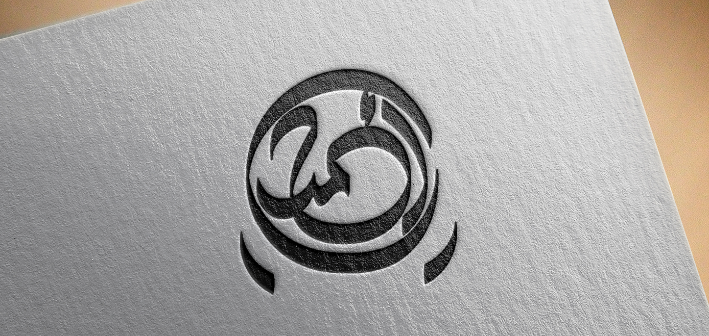

# Hello World!, I'm Hamody👋🏼:
studying Communication and electronics at faculty of engineering (Alexandria University) </i>

# 💻 Tech Stack:

        
  
       

<picture>
  <source media="(prefers-color-scheme: dark)" srcset="https://raw.githubusercontent.com/tobiasmeyhoefer/tobiasmeyhoefer/output/github-snake-dark.svg" />
  <source media="(prefers-color-scheme: light)" srcset="https://raw.githubusercontent.com/tobiasmeyhoefer/tobiasmeyhoefer/output/github-snake.svg" />
  
</picture>
